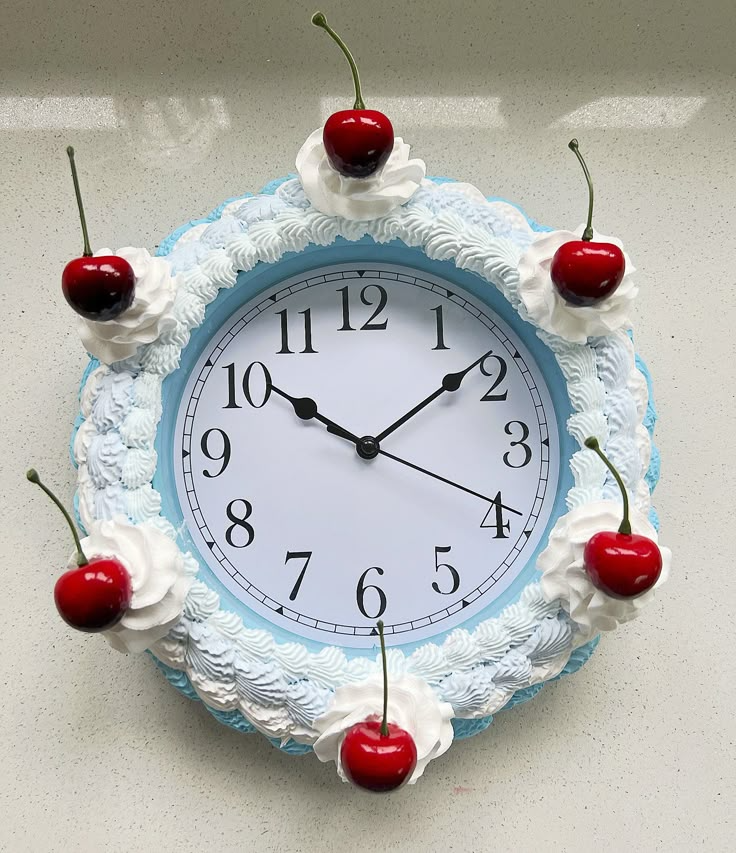

### MDDN 242 Project 1: Time-based Media  
### Jazzelle Richdale
# Taking Sweet Time

### Design Intentions
For this project I really wanted to brush up on my coding skills, as I was very out of practice. I pushed myself to solve problems that were outside of my comfort zone, such as making imported objects disappear (as P5JS doesn’t have an erase function). This project has helped reacclimate me to coding in P5JS, and I learned some new coding techniques as well. In terms of visuals I wanted a very vintage, tea party-esque feel to my clock. To achieve this I looked to vintage cakes for inspiration, and stuck to a pastel color palette. While looking back I feel like my project is quite simple overall, it has really helped me become confident in coding again. ppreview

### Inspiration
I was initially inspired when I saw a clock-themed vintage cake on Pinterest. It made me think about how cakes and clocks are both circles with segmented ‘slices’. I wanted to animate cake slices being taken on the hour, and I went from there. I took visual inspiration from many photos of vintage style cakes and picnics. 

### Design Process

#### *Initial Ideas*
I started by thinking of what ideas/themes I wanted to include in my clock. I really want to explore the idea of time moving through us (as believed in other cultures) instead of us moving through time (how we traditionally see it). I also want to look into how time moves differently in relation to space.

I then completely scrapped all of that, while it was an interesting concept I wanted to go for something simpler so I remain sane. I decided to design a cake clock, where the candles light and are then blown out, and a slice is taken every hour.

#### *Image Placeholders*
To start with I made some slices in Adobe Illustrator, and exported all 12 slices as separate images. I then assembled them in code to make a full circle. These slices will later be replaced with actual cake slices, but I want to sort out my code before fully finalising my visuals. 

#### *Madea Clock*
I then finalised my Madea clock, where the numbers change size and colour according to the time. 

#### *Hours - Cake Slices*
I coded an if statement that makes parts of the cake move out and disappear on the first second of every hour. 
I then had some trouble with getting them to stay gone after an hour was up, as you cannot erase images on P5JS, you can only add. So I added an image of the plate underneath on top of the slices that have been taken, and set it to add an amount of plate images according to the hour. 
I then changed my 24 hour time to 12 hour time, with AM and PM. 

#### *Alarm - Fire*
I coded the alarm system, using the time until the alarm goes off to animate the candles flaring up and creating a huge fire. 

#### *Seconds - Candles*
I then added in the candles on the cake, representing the seconds. A candle is lit every 5 seconds and at the end of the minute they are all extinguished. After a cake slice is taken the candle is left on the plate below.

#### *ReadMe*
At this point I formatted my ReadMe, leaving spaces to fill in information later. 

#### *Importing Assets*
I created all the image assets in Adobe Illustrator, and imported them all in. 

#### *Minutes - Strawberries*
I then added some strawberries on a plate to the side, every five minutes one is taken until none remain on the plate.  

#### *Finalisation*
I added a cake slice in the corner and a tablecloth as a background. I updated and finalised my Read Me. 